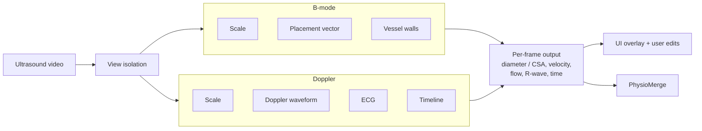
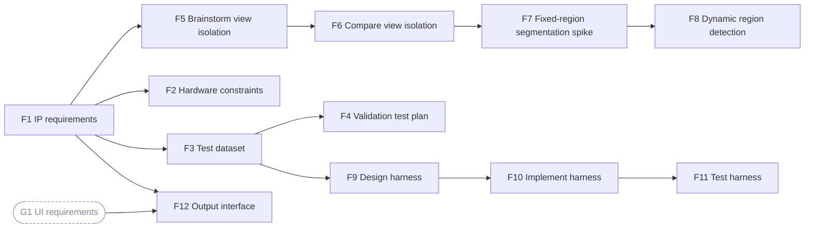
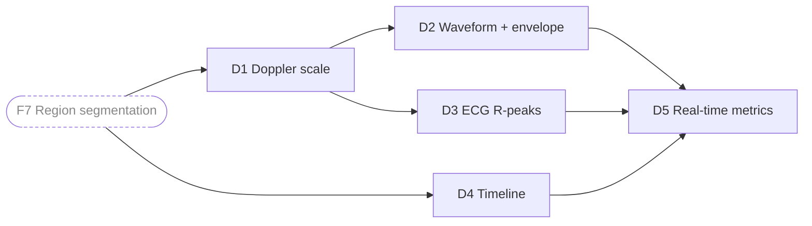
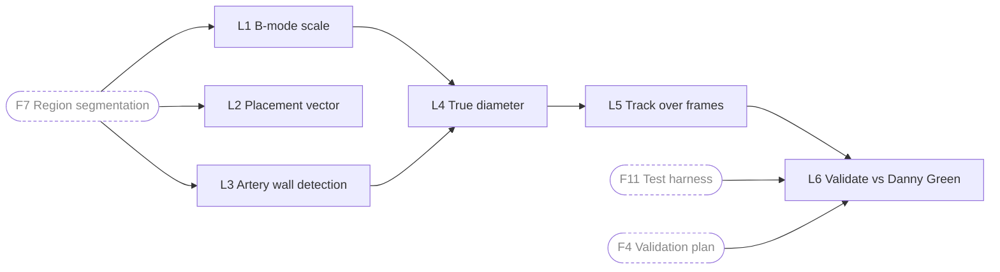
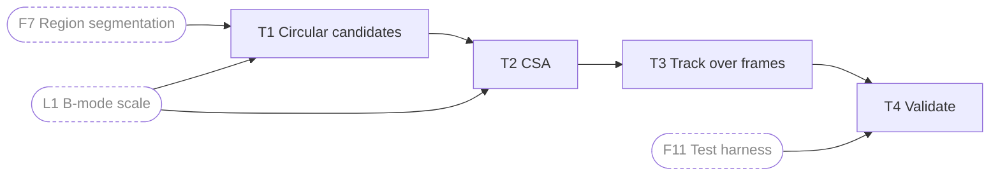
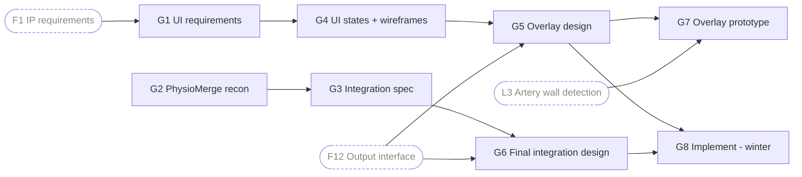

# Fall Work Breakdown & Component Milestones
**Created:** 2026-10-02
**Status:** Draft — no owners assigned yet
**Source:** Team Excalidraw breakdown and Overall Plan (2026-10-02), Taha's fall requirements email, 2026-09-28 stakeholder meeting

## Fall Goal
By the end of week 10 (**2026-12-04**), the full system design is complete and de-risked: every component has a written design, any uncertain algorithm has been prototyped and validated on the FMD recording, and the interfaces between components are fixed. Winter is implementation against this blueprint, then verification. A major problem that forces a design change should not be discovered in winter.

The design must be **general**, not tuned to one video or setup. Every component must tolerate:
- Changes in ruler baseline, scale, and inversion (e.g. negative values on top)
- Changes in depth during a recording, and the effect of depth on the view and measurements
- Probe/vessel position changes and movement between frames
- Bad frames: image dropout, artery and vein in the same view, neck movement
- Baseline and protocol (FMD, hypoxia, exercise) recordings, without knowing which is which

## System Overview

How data moves through the system, from the ultrasound video to the final outputs.

## Workstreams

Owners will be assigned once the team agrees on roles. The foundation stream is shared, because every other stream depends on it.

| Stream | Scope |
| --- | --- |
| **F** Foundation | Requirements, hardware constraints, test dataset, validation plan, region segmentation, test harness, output interface |
| **D** Doppler waveform | Doppler scale, waveform and envelope, ECG R-peaks, timeline |
| **L** Perpendicular diameter | Longitudinal view: B-mode scale, placement vector, vessel walls, angle-corrected diameter |
| **T** Cross-sectional area | Transverse view: vessel boundary, CSA |
| **G** GUI + PhysioMerge | PhysioMerge recon and integration, UI requirements, UI states, overlay |

## Milestone Mapping

Work is grouped by phase so each milestone matches its title in [Milestone 0](../Stakeholder_Milestones/Markdown_Files/Milestone_0.md) and feeds that milestone's course deliverable. Within M2, the highest-risk algorithms are tested first with throwaway code, so problems that would force a design change surface in fall rather than winter. Milestone leads are listed in Milestone 0.

| Milestone | Dates | Phase | Tasks | Course deliverable |
| --- | --- | --- | --- | --- |
| [M1](../Stakeholder_Milestones/Markdown_Files/Milestone_0.md#milestone-1-preliminary-research--design-inputs) Preliminary Research & Design Inputs | Oct 3 – Oct 23 | Gather requirements, data exploration | F1–F5, G1–G3 | PR2 (Oct 23); advisor meeting agenda (Oct 22) |
| [M2](../Stakeholder_Milestones/Markdown_Files/Milestone_0.md#milestone-2-research--design-planning) Research & Design Planning | Oct 24 – Nov 6 | Proof-of-concept spikes (throwaway code), UI wireframing | F6, F7, F9; spikes for D1–D4, L1, L3, L4, T1; G4, G5 | Advisor meeting 1 (Oct 29) |
| [M3](../Stakeholder_Milestones/Markdown_Files/Milestone_0.md#milestone-3-component-prototyping--design-outputs) Component Prototyping & Design Outputs | Nov 7 – Nov 20 | Turn successful spikes into prototypes | F8, F10–F12; prototypes for D1–D5, L1–L5, T1–T3; G5, G7 | Advisor meeting agenda (Nov 19) |
| [M4](../Stakeholder_Milestones/Markdown_Files/Milestone_0.md#milestone-4-final-implementation-plan) Final Implementation Plan | Nov 21 – Dec 4 | Validate and document the design | D5, L6, T4, G6; final design document | Advisor meeting 2 (Nov 26); POC (Dec 3); PR3 (Dec 11) |

**Design freeze:** all prototypes working by **Nov 20**, so M4 is for validation, documentation, the POC demo and advisor feedback, not new algorithm work.

## Task Breakdown

Dashed rounded boxes are inputs from other workstreams. A milestone written as "M2 → M3" means a throwaway spike in M2, then a prototype in M3. Tasks marked *(winter)* are designed in fall and built in winter.

### F — Foundation (shared)

| ID | Task | Depends on | Milestone | Output |
| --- | --- | --- | --- | --- |
| F1 | Enumerate image processing requirements (all regions on screen, all measurements, robustness cases) | — | M1 | Requirements list → `02_Requirements/Design_Inputs.md` |
| F2 | Determine hardware constraints: target machine, GPU or CPU only, whether processing must run in real time | F1 | M1 | Hardware constraints → design inputs |
| F3 | Build test dataset from our recordings: small sample, Danny Green's values where possible, hand-extracted ground truth (scale, expected graph values) | F1 | M1 | Labelled dataset |
| F4 | Write validation test plan against Danny Green's software and any other references | F3 | M1 | Validation plan |
| F5 | Brainstorm methods to segment the video into regions (ultrasound, graph, scale) | F1 | M1 | Candidate methods |
| F6 | Compare segmentation methods | F5 | M2 | Comparison matrix → `04_Design/02_Evaluation_Matrices/` |
| F7 | Spike: reliably segment regions on the test dataset, starting with fixed regions | F6, F3 | M2 | Throwaway code + results |
| F8 | Prototype dynamic region detection (regions found automatically, not hard-coded) | F7 | M3 | Prototype |
| F9 | Design test harness that runs the image processing tasks against the dataset | F3 | M2 | Harness design (inputs, ground truth format, metrics) |
| F10 | Implement test harness | F9 | M3 | Runnable harness |
| F11 | Test harness | F10 | M3 | Harness verified on FMD video |
| F12 | Define output interface to UI and PhysioMerge, including how messy data is represented (deleted frames, nulls, error values) | F1, G1 | M3 | Per-frame data schema |

### D — Doppler waveform

| ID | Task | Depends on | Milestone | Output |
| --- | --- | --- | --- | --- |
| D1 | Read the Doppler scale with OCR (values, baseline, inversion, scale changes mid-recording) | F7 | M2 → M3 | Scale method |
| D2 | Convert the bottom graph into time-series data; find the upper, middle and lower envelope | D1 | M2 → M3 | Waveform method |
| D3 | Separate the green ECG trace from the white Doppler trace; detect R-peaks (Pan-Tompkins) | D1 | M2 → M3 | R-peak method |
| D4 | Follow the timeline: current time being processed, using timestamp metadata rather than an assumed fixed frame rate | F7 | M2 → M3 | Timeline method |
| D5 | Real-time metrics: velocity, systole/diastole, pulsatility index (use PhysioMerge where possible) | D2, D3, D4 | M3 → M4 | Metric definitions + validation |

### L — Perpendicular diameter (longitudinal)

| ID | Task | Depends on | Milestone | Output |
| --- | --- | --- | --- | --- |
| L1 | Read the B-mode depth scale with OCR — **shared with T** | F7 | M2 → M3 | Scale method |
| L2 | Isolate the placement vector / locator box, including when it changes shade, opacity or disappears — **shared with T** | F7 | M3 | Locator method |
| L3 | Edge-detect artery wall contours; keep the best candidates ready so the user can switch quickly | F7 | M2 → M3 | Wall detection method |
| L4 | Calculate the true (angle-corrected) diameter rather than the vertical distance | L1, L3 | M2 → M3 | Diameter method |
| L5 | Track diameter across frames (pulse, FMD dilation, movement) | L4 | M3 | Tracking method |
| L6 | Validate against Danny Green's software on the test dataset | L5, F4, F11 | M4 | Comparison results |

### T — Cross-sectional area (transverse)

| ID | Task | Depends on | Milestone | Output |
| --- | --- | --- | --- | --- |
| T1 | Detect circular vessel candidates | F7, L1 | M2 → M3 | Candidate detection method |
| T2 | Calculate CSA for each candidate (artery and vein) | T1, L1 | M3 | CSA method |
| T3 | Track CSA across frames, including vein collapse | T2 | M3 | Tracking method |
| T4 | Validate CSA (manual tracing as ground truth, since no existing software measures CSA) | T3, F11 | M4 | Validation results |

### G — GUI + PhysioMerge

| ID | Task | Depends on | Milestone | Output |
| --- | --- | --- | --- | --- |
| G1 | Enumerate UI requirements (view selection, vessel selection, edge editing, reviewing values) | F1 | M1 | UI requirements |
| G2 | PhysioMerge recon: how it handles data, what functions and commands it gives us | — | M1 | Recon notes |
| G3 | Write PhysioMerge integration spec: how it handles noise, what error handling we need on our end | G2 | M1 | Integration spec |
| G4 | Define UI states and expected uses: process a full video, edge-detect an artery on one frame, let the user fix the detection (what feedback shows their fix), pause, cancel, undo | G1 | M2 | UI state list + wireframes |
| G5 | Design the UI overlay (Figma) | G4, F12 | M2 → M3 | Figma prototype |
| G6 | Finalize PhysioMerge integration design (which steps we hand off: systole/diastole, data deletion, metrics) | G3, F12 | M4 | Integration design |
| G7 | Prototype the overlay on the FMD video (best candidate + user edits) | G5, L3 | M3 | Overlay prototype for POC demo |
| G8 | Implement full UI overlay and integration *(winter)* | G5, G6 | — | — |

## Open Questions

### For the team
- Owner assignments for each workstream.
- Does the user select the view (longitudinal/transverse) or does the software detect it?
- Who does the manual tracing used as CSA ground truth?
- Accuracy targets for diameter, CSA and velocity (needed for the harness design and design inputs).

### For Taha
- How does PhysioMerge receive data from external tools? Do we import its packages, or send data through a script or the command line? Where is the documentation for its commands?
- What are the hardware specs of the machines this will run on? Is there a GPU for image processing, or only a CPU?
- Does the green box or line on the main video ever change shade or opacity, or disappear?
- When the depth or scale changes mid-recording, does the video black out, flicker or reload, or does the scale switch to the new numbers instantly?
- When data is messy (e.g. the artery leaves the screen), how should that appear in the output? Delete those frames, or give a null or error value?
- Are recordings at a constant frame rate, or variable?
- How do you picture selecting the vessel to track: clicking inside the lumen, or drawing a bounding box?
- Are you marking the fall reports?

## Revision History
| Date | Version | Changes |
| --- | --- | --- |
| 2026-10-02 | 0.1 | Initial draft from Excalidraw breakdown and Taha's email |
| 2026-10-02 | 0.2 | Split diagram into high-level system overview and per-workstream task diagrams |
| 2026-10-02 | 0.3 | Removed owners; added Overall Plan tasks; grouped tasks by milestone phase |
