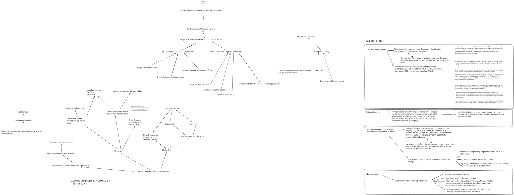

# Meeting Minutes Template

## Meeting Information

**Meeting ID:** MTG-001
**Date:** 2026-10-02
**Time:** 9:30 - 10:30
**Location:** Discord
**Type:** Internal

## Attendees

| Name   | Present |
| ------ | ------- |
| Baoze  | Yes     |
| Kyle   | Yes     |
| Seaya  | Yes     |
| Ursula | Yes     |

## Agenda

1. Assign items for future milestones
2. Install Zed for easy collaboration

## Discussion Notes

### Topic 1: Milestone planning

- assigned all tasks for future milestones
- sent to Taha for feedback and verification

# Appendix

Planning for milestone deliverables:

